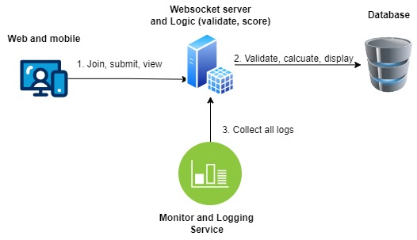
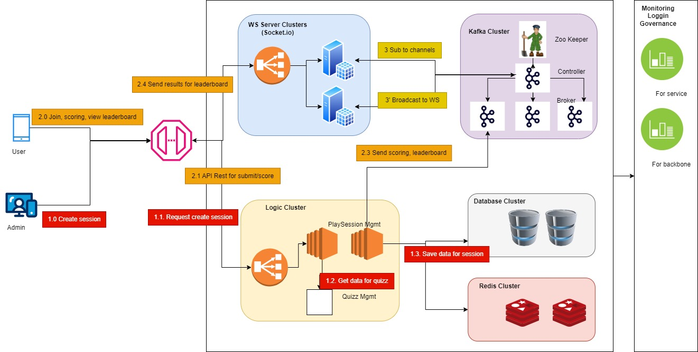

# System Design

For the realtime system, we can consider 2 approachs: polling (short and long polling) and websocket. And we can consider KISS principle when design this system.

## **Solution 1:** the simplest one

In this architect, the system will follow a typical client-server model, with WebSocket or API polling for enabling real-time communication.

- **Web / Mobiles**: used by participant / admin to create quiz session, join quiz session, submit answers and view the leading board. Web / Mobiles will send websocket / API Rest to Websocket Server and Logic server to submit anwsers and get results (polling if api-rest)
- **Websocket / API Server**: receive requests and send back to clients. If websockets, it's stateful connection. If api polling, it's stateless connection. We can write a very simple websocket servers
- **Database**: for store anwsers, compare with solutions and return the scores for all participants.
- **Logging and monitoring system**: for logging all requests comming, responsed returning (later used for trouble shooting)

This approach is simple and maybe suitable for the beginning or POC of systems. But for better scalability, performance optimizing, we should see the approach 2 (decouling the components)

## **Solution 2:** decouple each components
- [ ] Use API Gateway: for centralize all API endpoint and can monitor, set the request rate and protect API via authentication / authorization plugin.
- [ ] Use Socket.IO (Websocket Server): no need to write websocket server because socket.IO is very well-known and easy to operate. Also decouple server: Websocket Server for send realtime leader board result to client and API Server for submit and calculate scores. Websocket server also used only as transportation layers.
- [ ] API Server: use for receive the answer, calculate scores, send the scores/leader boards to Websocket Server or Message Brokers.
- [ ] Database Server: store the data
- [ ] (optional) Load balancer
- [ ] (optional) Kafka or Redis pub/sub: if need to scale up Websocket Server, due to of stateful connection to Websocket Server, so that each clients do not know about each other --> so that we need Message Broker System for exchange / broadcast to multiple instance of Websocket Server (here is Socket.io)
- [ ] (optional) Redis or Memcached: actually DB is enough if design as clusters. Caching will be use as buffers for super fast saving and retrieving data because it live in memory. But caching maybe have problems of invalidating.
- [ ] (optional) DB Proxy or Data Gateway for monitor / replica / ...
- [ ] Log Server and ELK Stack: for see the logs (exceptions, error, assertion) and monitor health (ready and lively of backbone apps, logic app)

In this architect, **the ideas are:**
- Only focus on logic app (backbone app are mongodb/postgress, kafka/redis pubsub, socket.io, ELK/Grafana, apigateway / kong, cognitor/keycloak)
- For submit the anwsers, use api-rest. For realtime get the results, use websockets.
- Can scale horizontally by making clustering (should use k8s for easiest deployment)

**Prefers**: solution 2 but can decouple one by one. Not neccessary build every components as clusters at the beginning (due of complex and too much components)

**Components decriptions:**
|  Components|Desc  | Technology
|--|--|--|
|Clients  |The front-end interface which users interact with the quiz, submit answers, and view leaderboards. Clients initiate a WebSocket connection for real-time communication and post API-Rest for submitting anwser | Flutter for mobile / Reacts for Web (learning curve fast) |
|API Gateway|This handles initial requests, including joining quizzes and WebSocket connections for real-time updates. | Kong with plugin to Keycloak (for JWT Authen/Author |
|Websocket Server|Provides real-time communication, broadcasting updated scores and leaderboard changes to all connected clients. | Socket.io (easy to master) |
|API Server| AKA: QuizSession Service. ContainsManages quiz logic, including tracking participants, receiving and validating answers, and calculating scores. 2 modules: quiz and leader. QuizUServ used for manages quiz logic, including tracking participants, receiving and validating answers, and calculating scores. LeaderUService used for maintains the state of the leaderboard and sends real-time updates to all clients whenever scores change. | Golang / Java for fast execution time |
|Database Server| A persistent store for quiz questions, user data, and session information. NoSQL (e.g., MongoDB) for fast access to leaderboard and quiz details.| MongoDB (documents data, random access) |
|Loadbalancer| Ensures traffic is evenly distributed across multiple instances of the QuizSession Service and WebSocket servers| K8s (automatic scalling)|
|Message Broker|Enable realtime communication between services / backbone app| Kafka (reatime broadcast)|
|Monitoring/Logging|Tracks the system performance and logs errors for observability.|ELK / Grafana (Centralized log system / Beat clients)|

