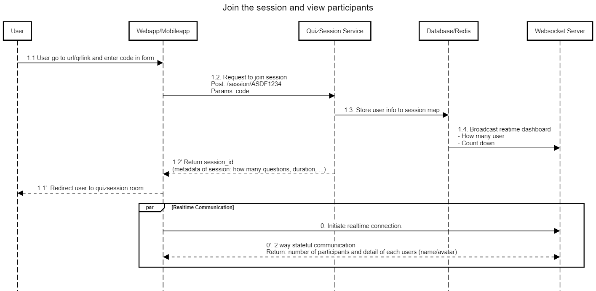
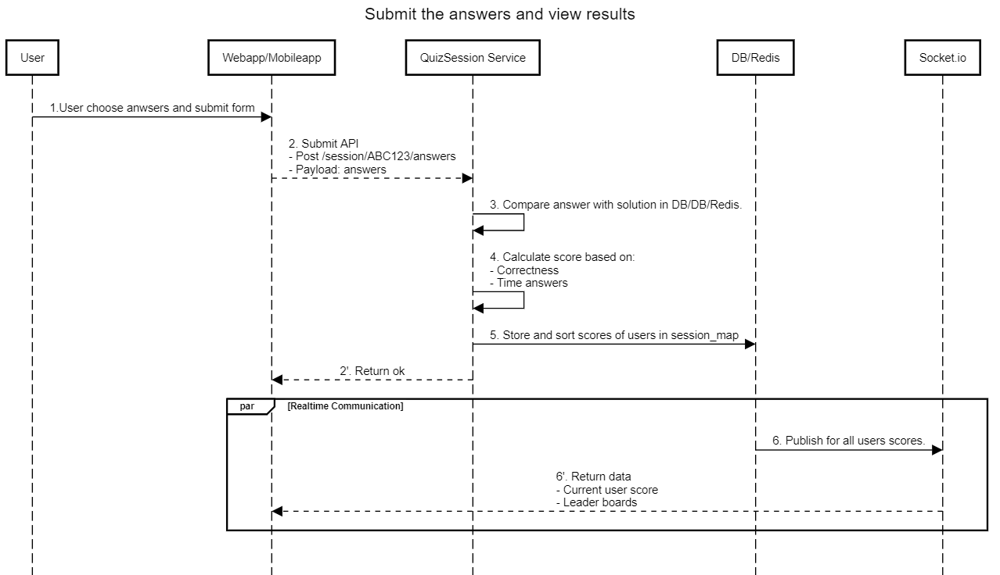

# Data Flow
## Flow1: Joining the session and view participants info
[Sequence diagram](https://sequencediagram.org/index.html#initialData=C4S2BsFMAIBUAsQGdrOgQ2qCkBQuBVJSAJwFoA+AdUgCN0AHBgegFkB7WkKRhgLgCMAOgHQipaAHN2WGQFcS4ZgEdFIAHYBrDOoAm0SOuASAxu10wN0AGbsSAW1w16TNp26RelaAEU5IAC8AZUgkJBB2dWgQkgA3EBNIQSEAJiFoACVIZTlQ4FloACt2K2IwiPUAHXUABXYkYD5oZjLwyOYAQSCAEQAxARSAZgAWapr0EnR7JCazC1w-QJDyyOjSeMTKLN1kZMH0oOA7GDliElR1WwLWiuh7Rlxt5EpnJHYTTUh8mNjSZOH0gAhEjsdC6EzoBrQEieUD2GC6SHwWigki6apkaAACXYAHc7uh1ABPaCnUgY6AAYXYciM0F0ePUC38wVCbSiPwSkDI3mcvDcXB4TGSKQA5EIssAFFEbpEAPogdHqAAU8OAYPQ6ug7Gs0Fl6ia8DxBOJ0ByeQqSAANPSFJqKjahE6AJROOj8jiCzxMHkUcQkJrCATizKQHYwkz5MnnI5mln66HsdiOPmuT0eLzUOhvD5fNZxP7QAAM6QAkuowCBNTAYehwHCYGZ1OpIJGKkI3bQc59vutSAAeX2pljpoX8IshlLQXHoEkNavWOTgaBmez2WkJe2RaqS6VNdRyey0CQ66AMCagEwgc9GFCE-QWdXcbW6zwmeCks4oZXqKaQZjoLEmoTK6+BAA)

### **Acceptance Criteria: Quiz Participation**

1.  **Device Compatibility**:
    -   **Multi-Device Access**: Players must be able to join and participate in quizzes seamlessly from different device types, including smartphones, tablets, and computers.
    -   **Responsive Design**: The quiz interface should be responsive, ensuring that the experience is optimized for various screen sizes and resolutions.
    -   **Cross-Browser/Platform Support**: The quiz should be accessible through major web browsers and native apps (if applicable), with consistent functionality across platforms.
2.  **Join via Code**:
    -   **Unique Session Code**: Players must be able to join a quiz session by entering a unique session code provided by the host.
    -   **Validation**: The system should validate the session code before allowing players to enter. Invalid or expired codes must result in a clear error message.
    -   **Multiple Participants**: The system should support multiple players joining the same quiz session simultaneously without performance degradation.
3.  **Live Feedback**:
    -   **Immediate Response**: After a player submits an answer, they must receive live feedback indicating whether their answer was correct or incorrect.
    -   **Consistent Timing**: The feedback must be consistent across all participants, ensuring no significant delays between answering and receiving feedback.
    -   **Feedback UI**: The feedback should be clearly visible, with distinct indicators (e.g., green for correct, red for incorrect) and an option for short explanations if enabled.
4.  **Error Handling**:
    -   **Join Code Errors**: If a player enters an invalid or expired session code, the system should display a user-friendly error message with options to retry.
    -   **Network Issues**: If a player experiences network issues during the quiz, the system should handle reconnections gracefully and allow the player to continue without losing progress.
    -   **Streak Calculation**: Ensure streaks and rank updates are error-free, even under high load or network interruptions.

These acceptance criteria ensure that the quiz participation feature provides a seamless, real-time, and engaging experience across all devices while offering competitive elements like live feedback, answer streaks, and rank display.

## Flow2: Submit the answer and view leader board

[Sequence diagram](https://sequencediagram.org/index.html#initialData=C4S2BsFMAIGUFcBGBbM1gAsYEMB2BnAd0gCd9o8ATaANxEkOhMn3nGHwChOAHbE0AGMQfXMGgBVfKV78hIvOIDqkRNh48A9AFkA9ohBR1PWQJDDR4gIrwQAL1gt8IXbjik6gyKfmXoAEQAhTQAlSEoQLj4zC0U4XUEAa0hgADoXbilSAFoAPhU1DR19Q0hjAC5oAEZUrJJoQQxdXWkKXEJpMjbqVhQ0ADNdEmROAuNigyMNbLybe0d8Z1d3Ek9IcoAmVLgkVHEAQQAFAEkAHVxs6EOW8U1pRZdcTX3AgGEqjYBmTTwiUnxzpdDtgAJ7gXTYSiVX7EMjcOYOJyPFZrWa2REPZaOVbmdbQT7bV66ZDRHAEWHQQhgDDQfC6cDwUDLEBuIKaNlhCL4VKcBELJZubGo3J8pFYjy48oAFkJ2HAgjY2GAMHwgiGMDU0mornKgOgRJIzEEwFwTj1ABUQMgyX84aLMYKJV48hzwpFKgBWbawYDq7q0obiVXq8i6frQeCdcgs2li3AAfWQ6l56P5yKFuJm+VU4z0kzKGkqGwA5NswsB4CQ3LpEtxotAwnLQNb9cTkPBcOYlY9OK6uXlYAlkmkXJUAGzbQ5IcCRGmDepy8ARqO0tXMbmcQdJFLpXRZsZFPOlCpj0sNlKVtyUJXYPWvSvMMTL0ir9V6gAyZUoL8QEJIlC4SBcEoTggA)

### **Acceptance Criteria: Score Calculation and Leaderboards**

1.  **Time-Based Scoring**:
    -   **Score Calculation**: Player scores must be calculated based on how quickly they submit correct answers. Faster responses earn higher points.
    -   **Consistency**: The time-based scoring system must be consistent for all players, ensuring no bias due to latency differences.
    -   **Real-time Updates**: Scores should update in real-time for each player after they submit their answers, and any changes should be reflected immediately on the leaderboard.
2.  **Leaderboard Display**:
    -   **Real-time Leaderboard**: The leaderboard must display the current standings of all participants during the quiz. It should show the top performers based on the latest scores.
    -   **Position Changes**: Player positions on the leaderboard should adjust dynamically as scores update in real-time, reflecting any changes in rankings.
    -   **Data Shown**: Each player’s ranking, total score, and possibly their username or nickname must be displayed on the leaderboard.
    -   **Post-Round Leaderboard**: At the end of each round, the leaderboard must reflect the updated standings for all participants before moving on to the next question.
3.  **Final Score and Ranking**:
    -   **Final Score Display**: At the end of the quiz, the system must display each player’s final score, taking into account the time-based scoring from all rounds.
    -   **Final Ranking**: The leaderboard must display the final rankings of all players based on their total scores, with the top performer ranked first.
    -   **Accuracy**: The final scores and rankings must be accurate and take into account all rounds and any potential bonuses or penalties applied throughout the quiz.
    -   **Results Visibility**: All players should be able to see the final scores and rankings at the end of the quiz, ensuring transparency.
4.  **Error Handling and Performance**:
    -   **Score Calculation Errors**: In case of any error in calculating scores, the system should log the issue and display an appropriate message to users.
    -   **Leaderboard Update Latency**: Leaderboard updates should occur within a maximum of 1-2 seconds after a score change to ensure real-time performance.
    -   **Concurrent User Handling**: The leaderboard must function smoothly even with a large number of concurrent participants.

These criteria ensure the scoring and leaderboard feature is consistent, real-time, and transparent, enhancing the competitive aspect of the quiz experience.

